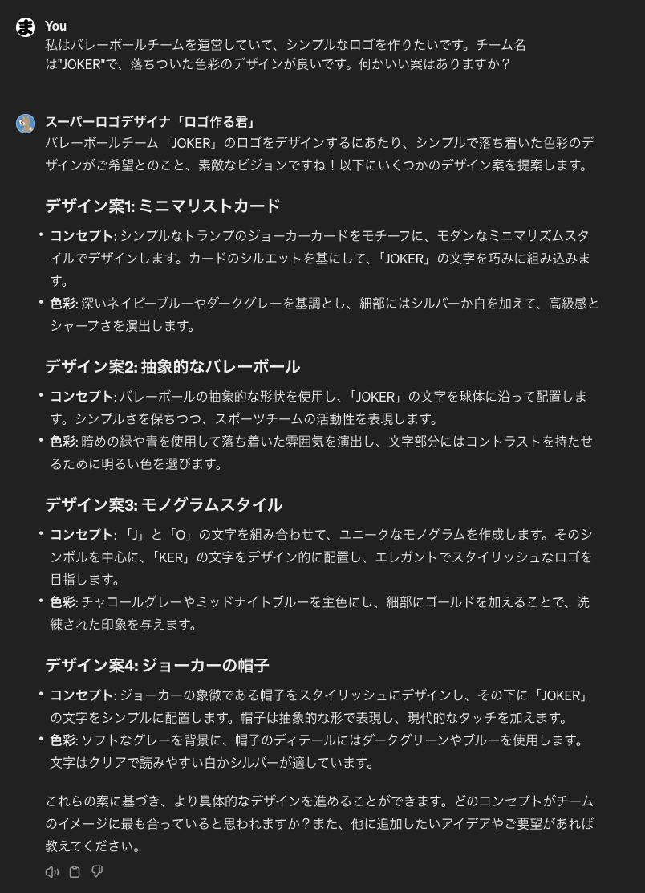
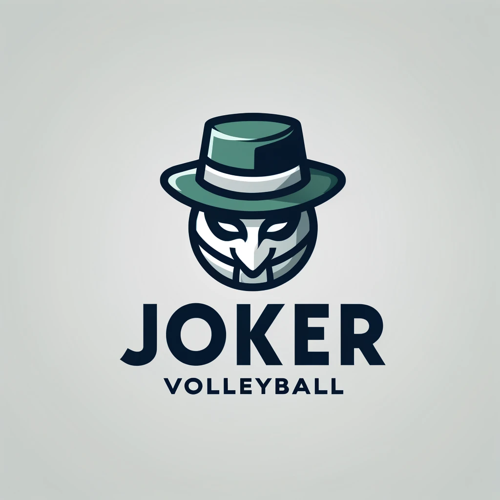

最近ChatGPTを使ってロゴを作成する機会があったので記事にします！

## 経緯
プライベートで参加しているバレーボールチームで、古くなったロゴを刷新したいという話が上がりました。
所詮社会人サークルのようなチームなので、デザイナーさんに頼む金銭的余裕もなく、自力で作ろうということに。
デザイン力は皆無なのでどうしようと思っていたのですが、「ChatGPTで作れたら楽そうだな」と思い立ち調べてみました。

## 使ったもの
今回ロゴを作るにあたって使ったのは、GPTsのスーパーロゴデザイナ「ロゴ作る君」です。


GPTsはChatGPTをカスタマイズできる機能です。
GPTsを使用することによって、オリジナルのチャットボットを作り、公開、使用することができます。
GPTsは「ChatGPT Plus」または「ChatGPT Team」などの有料プランに加入した人が使用できます。（今回作るに当たってChatGPT Plusに加入しました。。）

またこの「スーパーロゴデザイナ「ロゴ作る君」」はDALL E3を使用して画像を作成してくれるようです。

## 使い方
使い方について、手取り早く直接教えてもらいました。


基本的な手順は以下のようです。
1. ロゴをどのように使うか明確にする
1. 色や要素など、どのようなデザインにするか伝える
1. 提案されたデザインにフィードバックをする
1. 修正されたデザインを確認して、さらにフィードバックをする

一回の質問で目的のロゴを作ってもらうことは期待せず、何回か対話をした方が良いっぽいです。

また、どのような情報をインプットすればいいのかも聞いてみました。


1. ビジネスやプロジェクトについての情報
1. デザインのスタイル
1. ロゴに含めたい情報
1. 用途

上記に関しては最低限でも入れておいた方が良いでしょう。

## 実際にロゴを作ってみた

今回インプットに使ったのは以下のプロンプトです。
```
以下の条件でロゴを作りたいのですが、何か良い案はありますか？
プロジェクト：「JOKER」というチーム名のバレーボールチーム
スタイル：モダンでシンプルなデザイン
色：薄めの紫とグレー
用途：Webサイトやユニホーム
要望：チーム名「JOKER」をロゴの下部に入れる。バレーボールの要素をロゴに入れる。
```


この段階で出来上がったロゴがこちらです。


シンプルですが、なかなかです。
ここでさらにトランプのジョーカーの要素も入れてもらいました。


出来上がったものが以下です。


若干違和感ありますが、かっこよくできてます。
ただ、下部のチーム名が消えてしまったので再度依頼をかけてみます。


なんだかデザインが全然違うものに変わってしまいました。。
何回かやってわかったのですが、細かいデザインの修正は難しいようです。


ちなみにもっとざっくりした質問で案をもらうことも可能です。



これらの案から作られたロゴ画像が以下です。




なぜかこちらの方がカッコよく仕上がってます。。

## 終わりに

今回はChatGPTを使用してロゴ画像を作成してみました。
会話ベースで簡単にロゴ画像を作れるというのは大きなメリットです。
細かい修正ができなかったりと地味に使いにくさもありますが、工夫次第といった感じでしょうか。
OpenAIの規約では、有償プランに加入していれば作成された画像は商用利用可能なようです。（要確認）
GPTsには面白いものが多くあるので、また試してみたら共有したいと思います。
